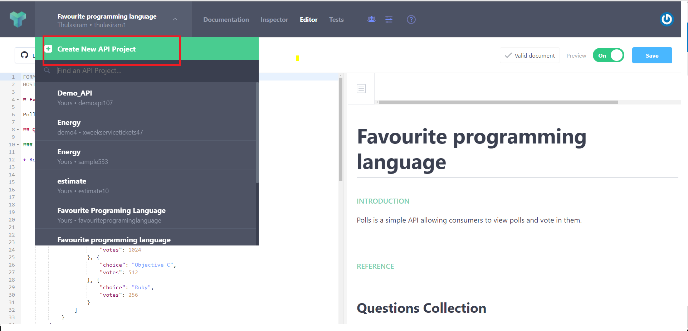
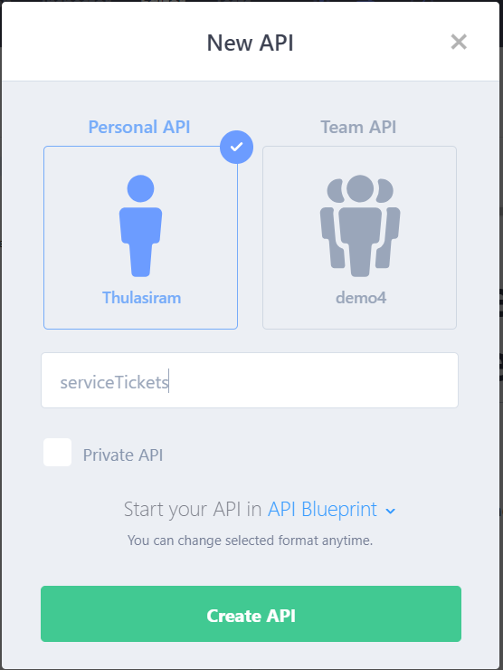
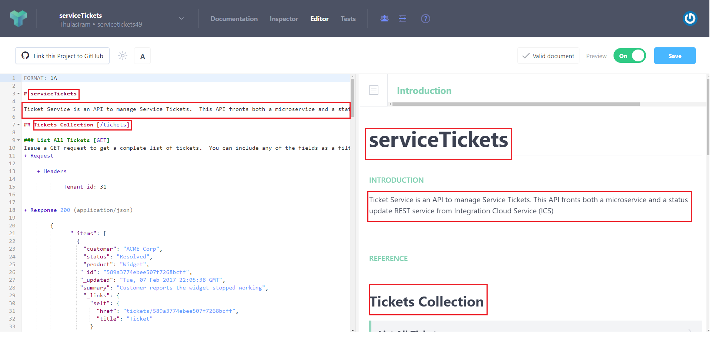
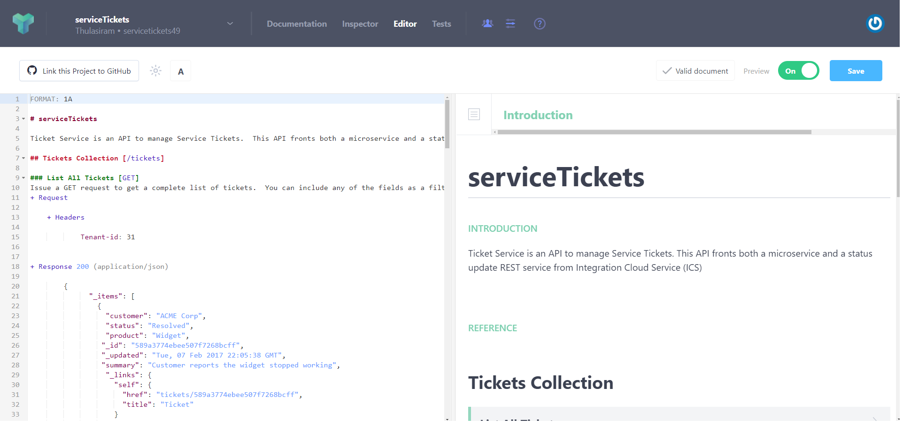
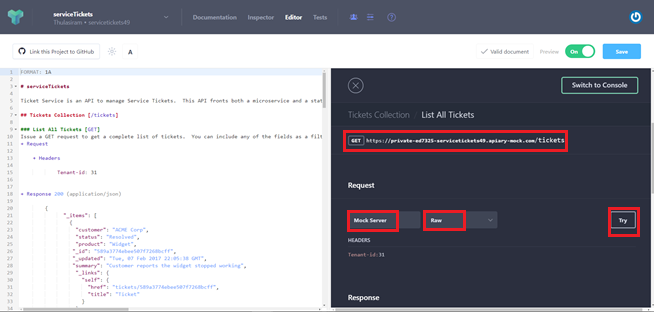
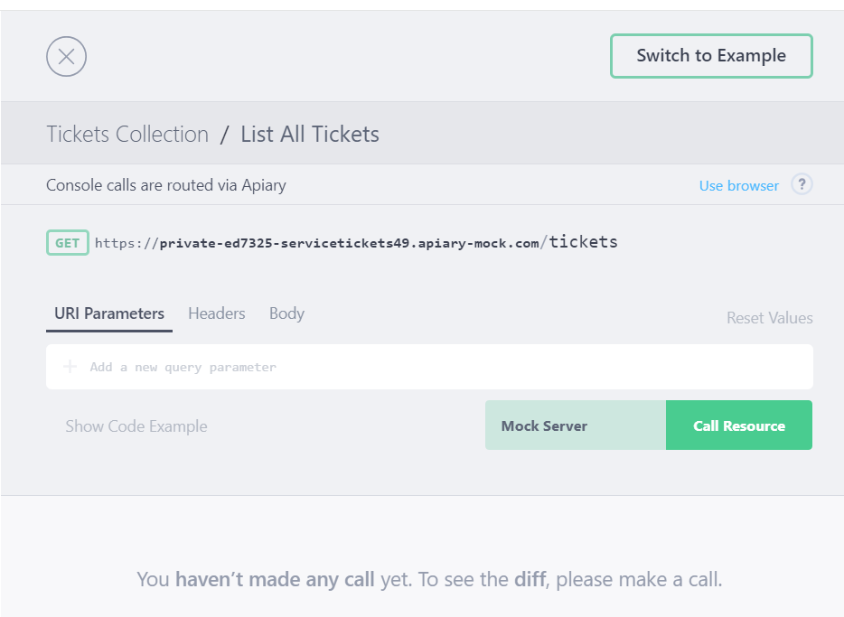
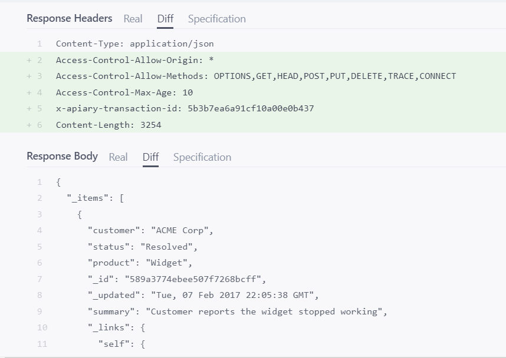
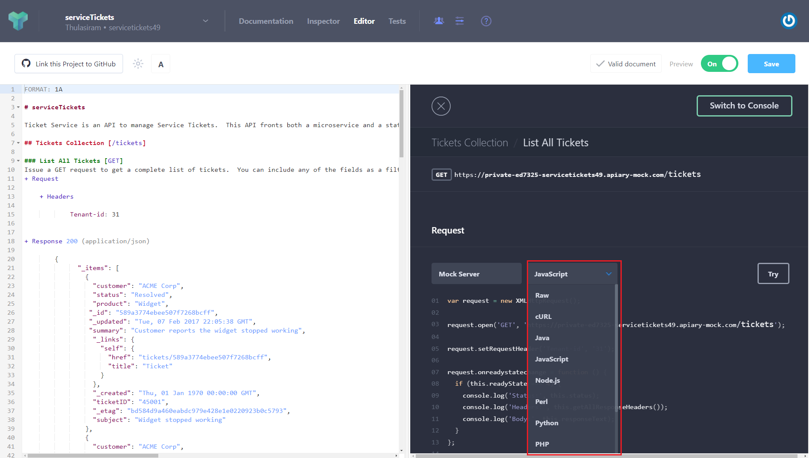
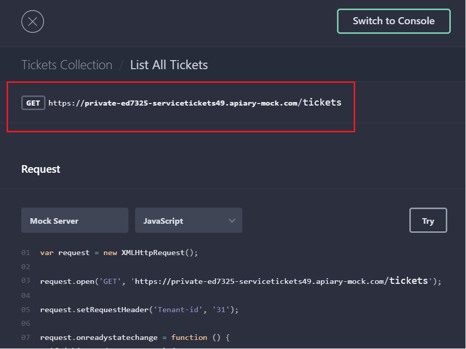

Lab 100 - Designing the serviceTickets API with Apiary
================
## Introduction

You need to have an account on Apiary. You can sign up for a free
developer account at http://apiary.io .

Use your Oracle email for setting up the account.

## Objectives
- Create an Apiary account and login
- Create the API Design

Get Started with Apiary and create an API Design
=======================

### **Step 1**: Create an Apiary account and login

### **Step 2**: Create the API Design

Log into your Apiary account(https://app.apiary.io) (see the Pre-work if you do not have an account) and click on Create New API Project

  

  1. Create a personal (not team) API called serviceTickets in the API Blueprint format. Private API is not checked when you select Personal API. It only shows if you select Team API

  

  2. Your API will be pre-populated from a sample template which you can begin modifying to meet the requirements of a serviceTicket

    -   Update the collection from "questions" to "serviceTickets"

    -   Update the description to a meaningful explanation of service
        tickets

    > You will see that on the left side, you have the API Blueprint and on
    > the right side, you have an easy to read documentation of your API.
    > You can try changing some things like the values in your JSON payload
    > or the descriptions around the text and you will notice the
    > documentation will update live as you work.

  

  3. Now, from the resources folder/site for the [API Github](<https://github.com/oracle/learning-library/tree/master/workshops/api-platform/tutorials/design/design_api>) and pull the ticketService.apib file in your favorite text editor.
  You can select all of the text and simply replace the text in your **Polls API** sample.

  

  4. Now, you can test the API blueprint by selecting one of the resources in your documentation

  

  5. Clicking on the link, will bring up the test example. Here, make sure you have selected the **Mock Server** and you can choose any language for an example **Raw**. Notice the example includes the URL and method as well as any parameters that are required.

  Additionally, there is a code-sample of how you would call the service in the language of your choice.

  

  6. Click Save and then click the Try button.

  

  7. Click on Call Resource and scroll down to see Sample Response

  

  8. You can switch back to the example to see other languages.

  

  9. Call the Mock Service URL with your REST client

  

Summary
=======================

Now, with your design in place, your application developer could begin working on the front-end, while your service developer's work on the back-end implementation and you can work on the API implementation, all in parallel.
