Lab 200 - Installing API Gateway
================
## Introduction

This is the first of several labs that are part of the **Create API on Oracle Integration Cloud**. Oracle API Gateways are software-based appliances that can be installed wherever you want, that is, physical or virtual compute on premise or in the cloud. This workshop will walk you through the process of creating Gateway and deploying it to API on Oracle Integration Cloud.

## Objectives
-	Provision Linux VM on OCI
-	Set Console Connections on the Linux instance
-	Allow inbound connections to the Linux instance
-	Install and configure logical API Gateway
-	Add additional roles to cloud.admin user
-	Install and configure host (server) API Gateway

## Required Artifacts

For this lab you will need:

- Oracle Cloud Accounts [Cloud Trial Account - https://bit.ly/2yvpjSH](https://bit.ly/2yvpjSH)
- Generate SSH Public and Private Key
- Download FileZila (Mac) or MoBaXTerm (Windows)

Create Linux VM and Configure and Deploy API Gateway
================

### STEP 1: Provision Iaas VM
1.  Log in to the cloud account which you just created
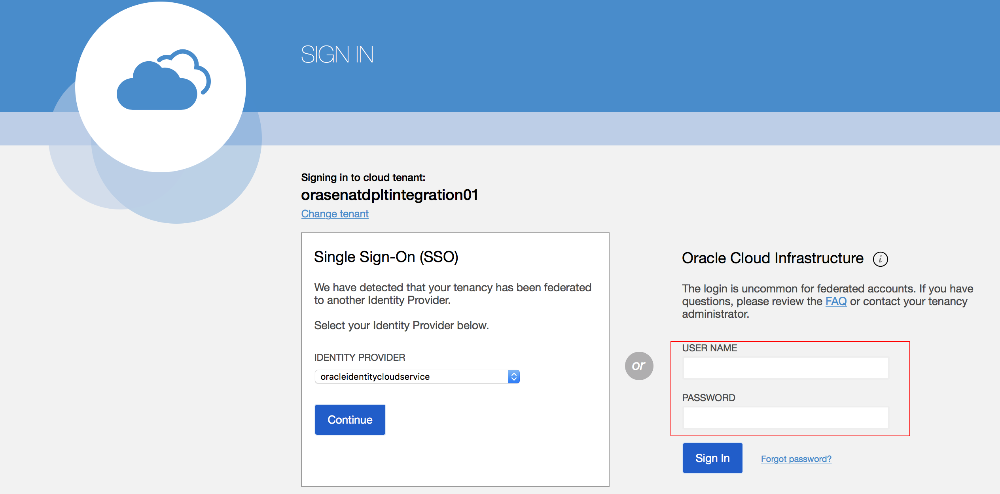

2. Click on thd **MENU** on the left top and click on **Compute**
  

3. After you opened the **Compute** page, pick one **COMPARTMENT** on the left corner  
  

4. Click on **Create an Instance**
  

5. Enter the following values in the Create Instance dialog
    (1)	**Name**: XX_OL610 (Replace XX with your initials)
    (2)	**Image Operating System**: Oracle Linux 7.6
    
    (3)	**SSH Keys**: Choose SSH Key Files
    (4)	Click on **Browse** and select the local public key (e.g. oci_instance.pub)
    (5) Keep all other values to default and click on **Create Instance**. After several minutes, your new Oracle Linux instance will be running
    

  **NOTE** Your Oracle Linux is now ready for the Gateway installation. Click on the newly created instance and note down the primary information, such as Private and Public IP Address.
  

### STEP 2: Create a Console Connection for Mac User

 We will now create a Console Connection, which allows us to use an SSH connection to the instance host.

1. On the instance page, click on the instance you just created
  

2. In the bottom left menu under **Resources**, click on **Console Connections**
  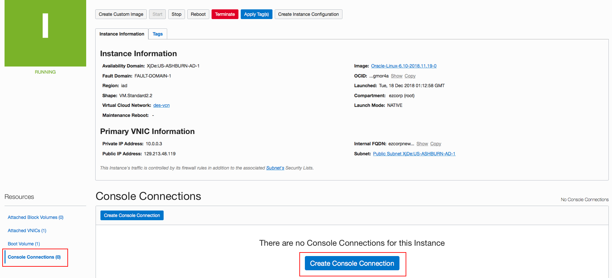

3. Use the provided SSH key to setup the console connection
  

4. When complete, the Console Connection will be in Active state

> Save a note of your **public IP** and **private IP** of your instance here, which will be needed soon.
  

### STEP 3: Allow inbound connections to the Linux instance
1. Stay on the Instance detial page, click on the **Subnet**
  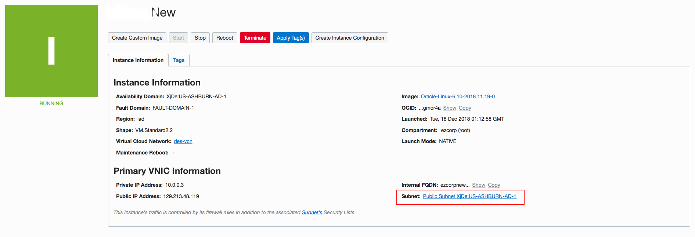

2. Open the **Default Security List for des-vsn**
  

3. Click the **Edit All Rules** on the top
  

4. The rules page will open which contains 3 default rules and **Add Ingress Rule**
  
  

### STEP 4: Setup API Gateway
 Now that we have provisioned an Oracle Linux environment, we are going to use it to continue installing an Oracle API Gateway and configure it to join our Autonomous API Platform instance. First let’s create the Logical Gateway configuration in our API Platform Management console. This is the space through which the physical API gateway will be in constant management and synchronization.

1. Click on **MENU** on the left top, and choose **My Services Dashboard** under **Administration**
  

2. Search the **Oracle Autonomous API Platform Cloud Service** and click on it
  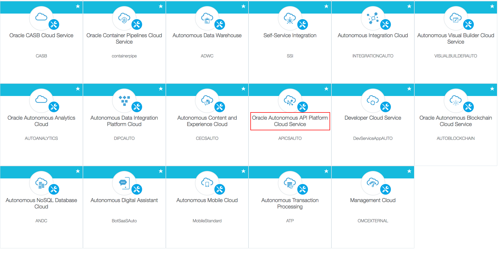

3. Create an instance by clicking the **Create** located on the right corner
  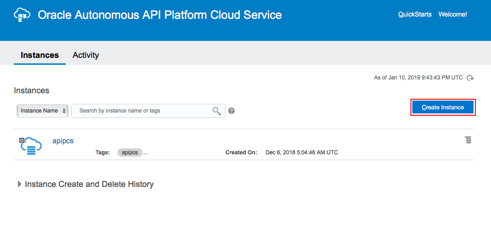

4. Fill out all the information it needed and click on **Next**
  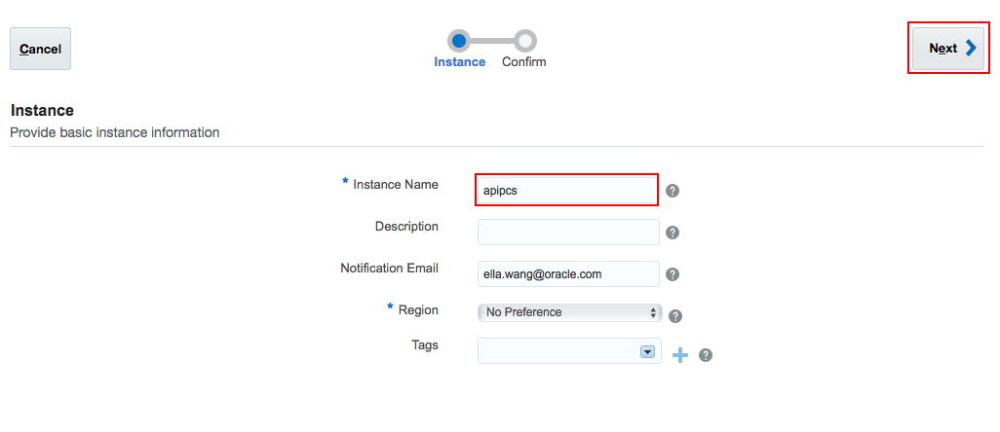

5. Confrim all the information and hit **Create**
  

6. After the instance created, click on the **hamburger** shape button and choose **Access API Platform Service Instance**
  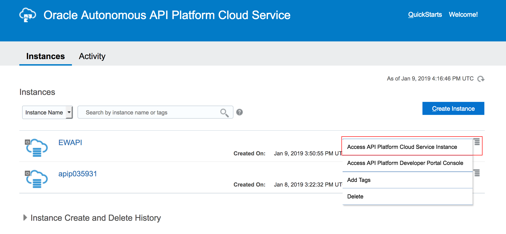

7. Click on the top left burger menu, select **Gateways**, and click on **Create**
  

8. Give it a good name and description. Then click **Create**
  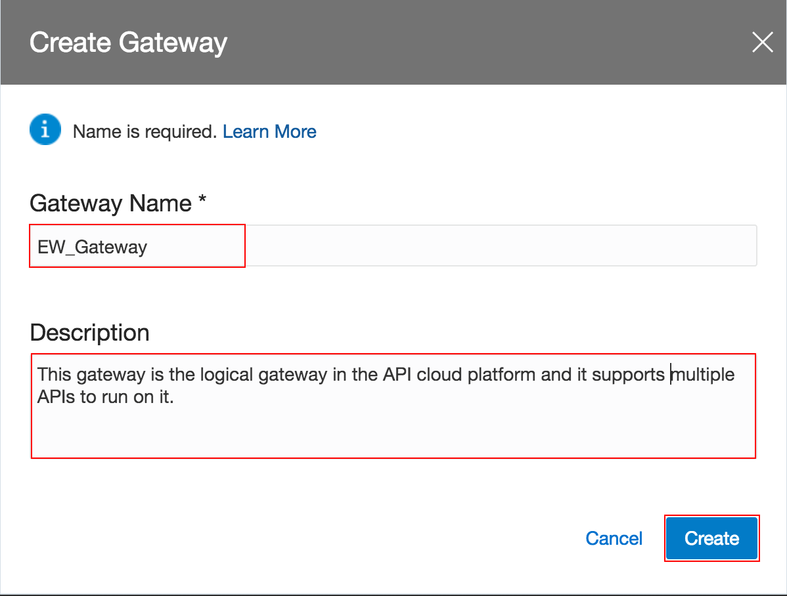

9. Now your new Logical Gateway is creating, click on it after it's done
  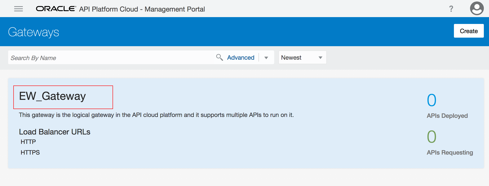

10. On the left vertical menu, click on **Nodes** and then click on **Open Installation Wizard**, it will help us build the properties file required to install and configure our physical API GW once downloaded
  

11. The Wizard will help us get all parameters auto-populated. Review and click **Next** button

12. In Step 2, set the next values:

    (1) Give it a good Gateway **Name** and **Description**

    (2) **Listen IP Address**: Enter the internal IP Address you noted in Step 2

    (3) **Published Address**: Enter the public IP Address you noted in Step 2
    > You also can get them by going back to Compute classic dashboard.

    (4) Proxy settings if needed

    (5) **Node Installation Directory**: Enter a location where you want to install your API Gateway within the Oracle Linux VM
    **Suggested: /home/opc/apigateway/install**

    (6) **Installation Archive Location**: Enter the location where you are planning to have your API Gateway
    **Suggested: /home/opc/apigateway/downloads**

    (7) Review your parameters and if all is right, click on the **Next** arrow.
  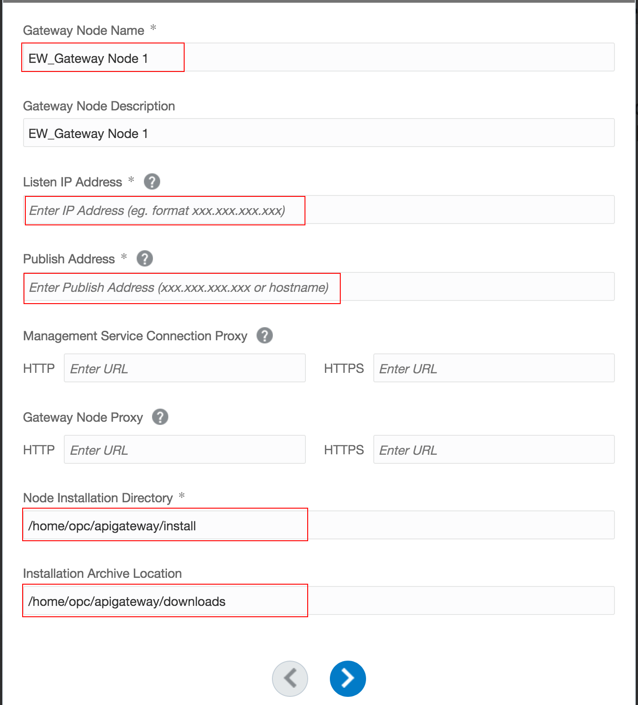

13. In Step 3, we are not setting anything else. Just take a note of the ports that your API Gateway will be using. This will be useful later. When done click on the **Next** arrow
  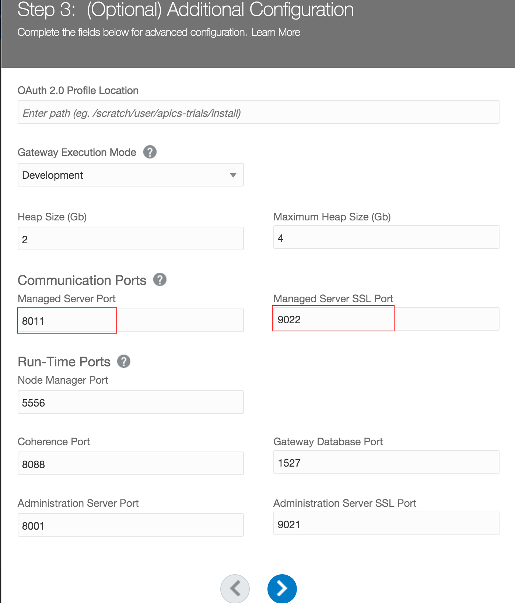

14. In Step 4. Click **Download file** to get the configuration properties file. Then, click **Done** to finish
  

### STEP 5 : Add API Manager and Developer Groups and Users (optional)

 You need to be admin roles to be able to create different types of groups and users in Oracle Identity Cloud Service (IDCS)

1. Go back to the Dashboard and click **Users** on the top
  

2. Click on the **Identity Console** button at the top right
  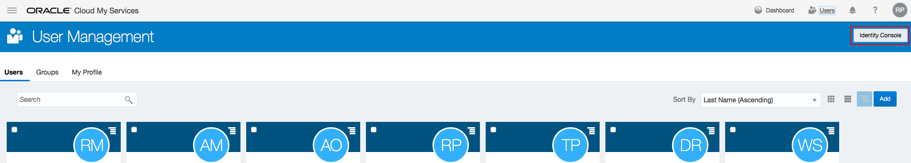

3. Click on the top left burger menu and then click on **Groups**, click **+Add**
  

4. The **Add Group** window will open and fill a good name and description, then hit **Finish**
  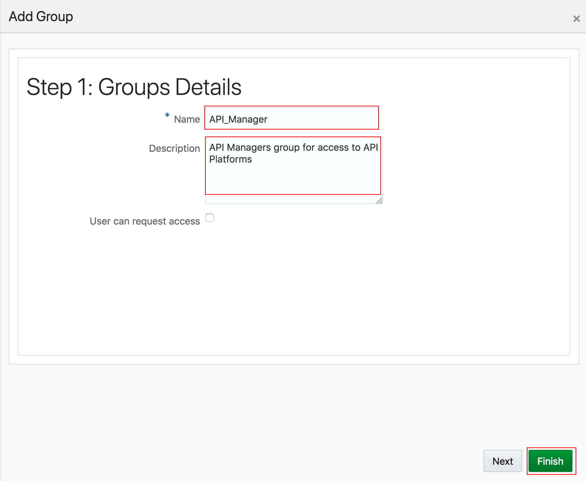

5. Repeat the previous steps and add another **Developers group**.
  

6. **If your API Manager/Developer users are not created, you need to create user profile next.** (optional)

    6.1 Use the top left hamburger menu again to go to **Users**, and click on **+Add** to create a new user
  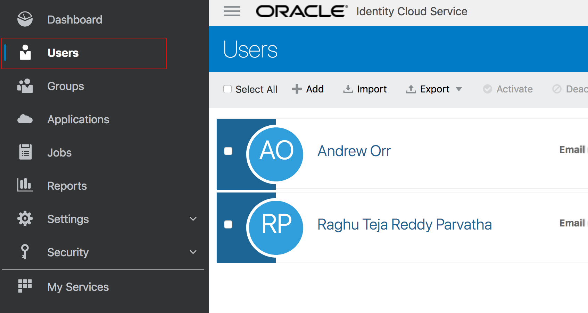

    6.2 Enter:
    **First Name**: XXX (e.g. API)
    **Last Name**: XXX (e.g. Manager)
    **User Name**: XXX (e.g. API_Mgr_User or use your email as username)
    **Email**: Make sure you enter a real email, as you will immediately receive and email to activate your user account and set the password.
    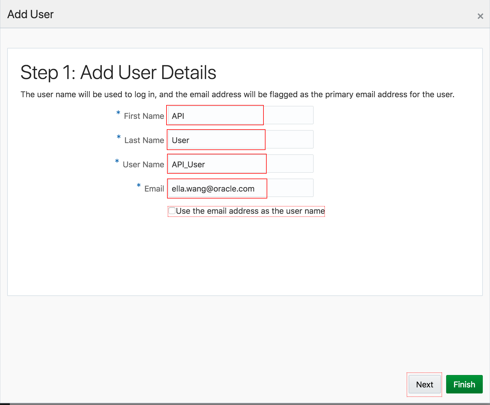

    6.3 Click **Next**, and choose the Manager’s group that you created previously, then click **Finish**
  

    > You should get a successful message. Similarly, you can create multiple users based on your need.

### STEP 6: Give Group/User Access to the API

1. Go back to the top left burger menu and select **Applications**
  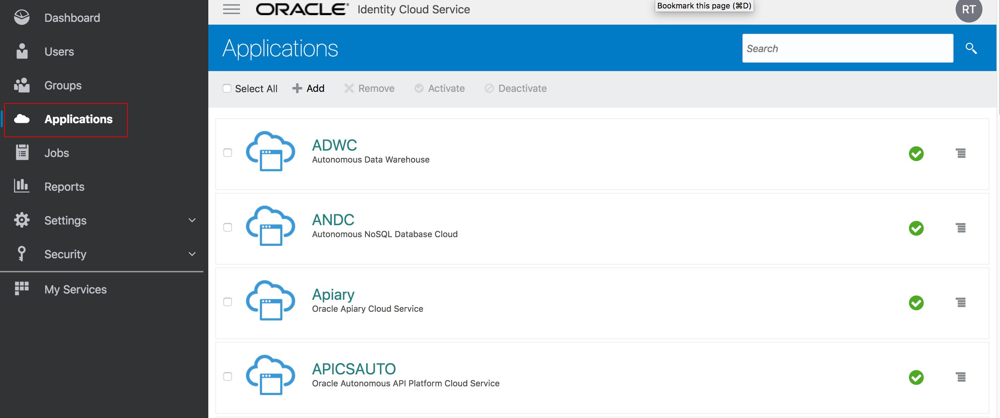

2. Locate and click on the Application that corresponds to the Autonomous API Platform environment that you provisioned in Step 4
  

3. Click on **Application Roles** tab
  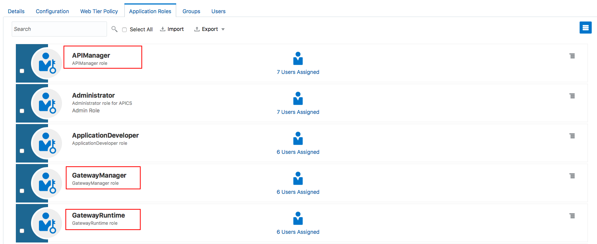

4. For simplicity purposes, add your API Managers group to at least **APIManager**, **GatewayManager** and **GatewayRuntime**. Do this by clicking on each of the role’s right end burger menu
  
  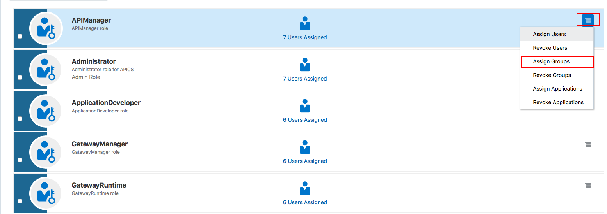
    >Note: This is just a simple test configuration. You might need to tighten your security for your own environments

5. Now, click on the burger menu for **ApplicationDeveloper** and add your Developers group
  

6. Taking advantage that we are here, click on the Configuration tab and copy to a safe place. We will need them to join the API Gateway in the next section
-- Client ID
-- Client Secret
  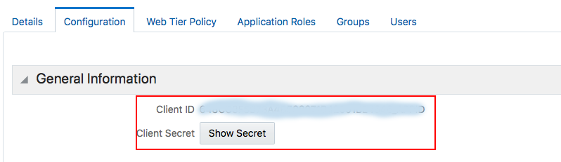

### STEP 7: Deploy an API Gateway – Install and configure Physical API Gateway

1. Use a File Transfer tool such as FileZilla (Mac) or MoBaXTerm (Windows) to copy files from the local machine to the VM instance
    

2. Open your Terminal(Mac) or Command Line(Windows). Change the directory to the location for the SSH keys
  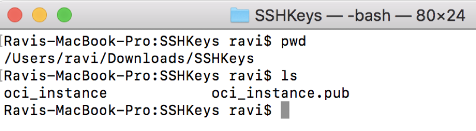

3. Run the following command to connect to the Oracle Linux instance:

    **$ ssh -i oci_instance opc@[your public IP address from Step 2]**

4. Additionally, run the following command to open the firewall of your instance:
    **$ iptables -I INPUT 1 -p tcp --dport 8011 -j ACCEPT**
    **$ iptables -I INPUT 1 -p tcp --dport 9022 -j ACCEPT**

5. If not already done, install Oracle certified JDK 1.8+ and set JAVA_HOME.

    -- Download the JDK file from website

    -- Copy the JDK file to the OL instance in the folder **/home/opc/java** using FileZila

    -- Install the JDK: **$ sudo yum localinstall jdk-8u181-linux-x64.rpm**

    -- Verify the JDK is installed under **/usr/java/jdk1.8.0_181-amd64**: **$ java -version**

    -- Set **JAVA_HOME**. Edit the **.bash_profile**
        

6. Now, run the codes to create **APIGateway** folder on FileZila which contains **install** folder and **downloads** folder

    **$ mkdir APIGateway**
    **$ cd APIGateway --> mkdir downloads --> mkdir install**
7. move the zipped ApicsGatewayInstaller file under downloads on FileZila
    

8. Unzip the ApicsGatewayInstaller file on FileZila

9. Replace default gateway.json file with the one you downloaded in Step 4

     ***Important: Replace the gateway-props.json file that is at the root of the just unzipped API gateway by the one that you just downloaded as a product of the Wizard.***

10. Run the following command to start the install:
    **$ ./APIGateway -f gateway-props.json -a install-configure-start-join**

    When prompted:
    -- Please enter user name for weblogic domain,representing the gateway node: **weblogic**
    -- Password: **welcome1**

    The installation will continue. After a few minutes it will ask you to enter the API Gateway Manager user that we created previously:
     -- Please enter gateway manager user: **API_Mgr_User** (or whatever API Manager user you created in the last section)

    -- Password: Enter the **password** that you set for your API Manager user.

    -- Please enter gateway manager client id: Enter your **Client ID** that you captured in the last section.

    -- Please enter gateway manager client secret: Enter your **Client Secret** that you captured in the last section.

    -- Please enter gateway manager runtime user: Enter your user assigned to the GatewayRuntime role. In this case I have the same API Managers group, so it is the same admin user.

    -- Please enter gateway manager runtime client id: Enter your **Client ID** that you captured in the last section.

    -- Please enter gateway manager runtime client secret: Enter your **Client Secret** that you captured in the last section.

    >Note: For some reason I got an error saying that it could not find the original Gateway (100) that I originally indicated in the gateway-props.json. I don’t know why? I got around it by saying yes when it asked me to create-join instead. I will investigate this issue and come back here. In the meantime, selecting y + [ENTER] to create-join the node instead got me going to the end.

### Step 8: Approve the Node on API Platform

  1. Go back to the API Platform Managers Portal and click on the new node. You should find a pending registration node
  2. Click **Approve**
    

**Now, the whole installation process should complete successfully! You can continue to next workshop.**

Summary
=======================
