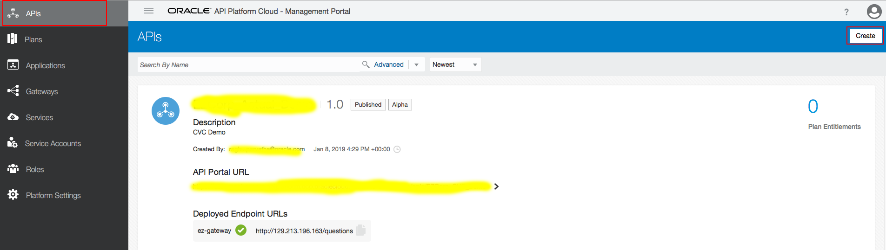
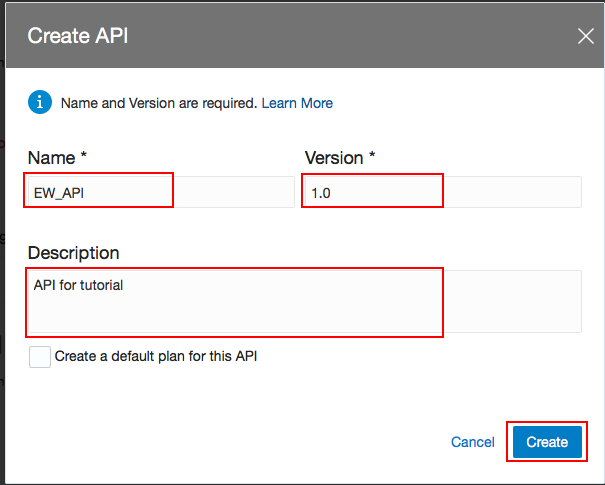
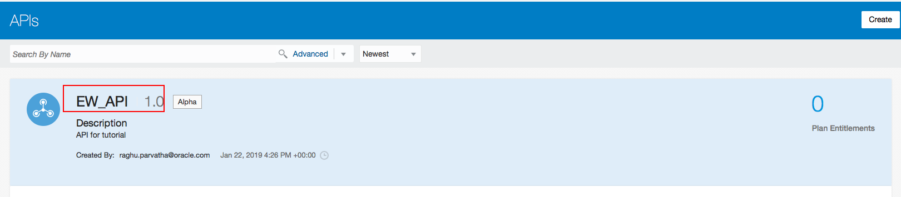
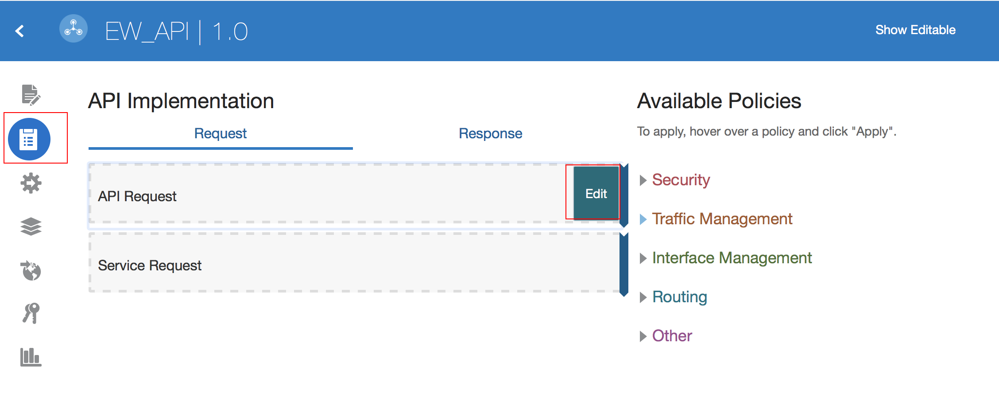
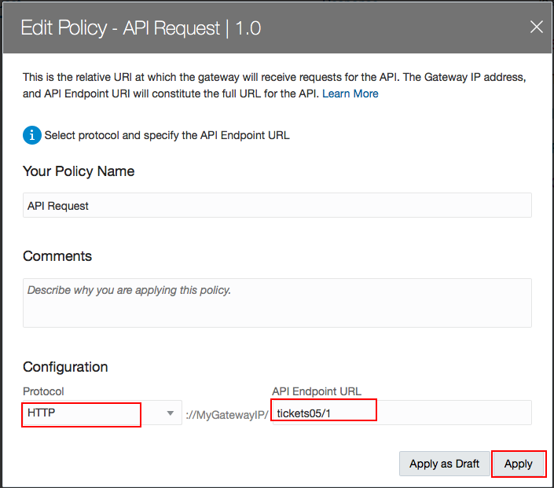
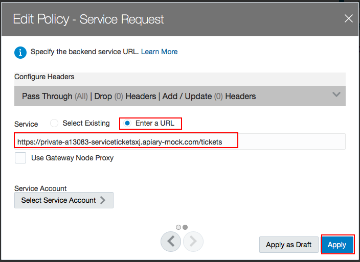
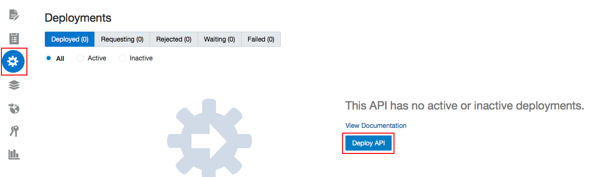
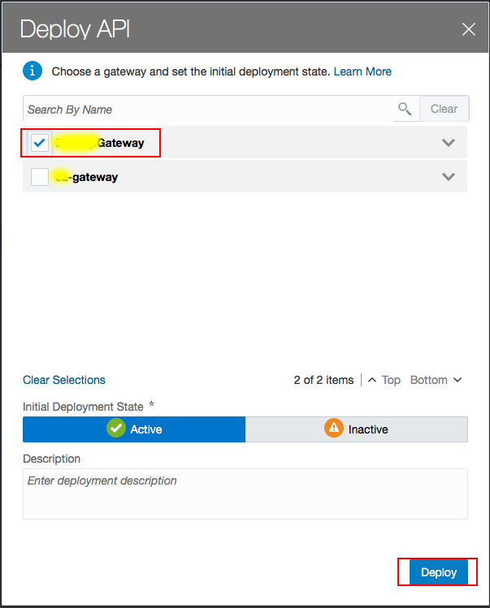
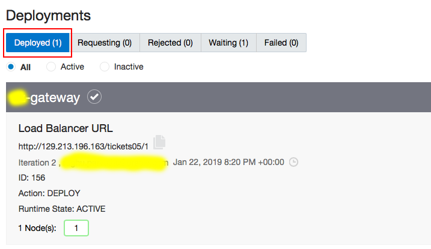
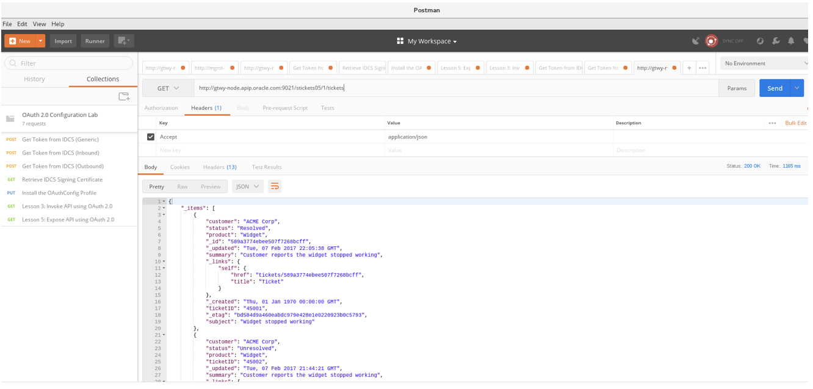

Lab 300 - Deploying ticketService API to Gateway
================
## Introduction

You need to have an account on Apiary. You can sign up for a free
developer account at http://apiary.io .

Use your Oracle email for setting up the account.

## Objectives
- Create an Apiary account and login
- Create the API Design

Deploy ticketService to newly created API Gateway
================
**Stay on the API Platform Cloud,the next step is to create API and deploy the gateway to the API.**

### **Step 1:** Choose **APIs** on the API Platform Cloud, and click on **Create** on the top right
	

### **Step 2:** the creating API page will open and fill out the form
	

### **Step 3:** Your new API is created now, and click on it
	

### **Step 4:** Configure the API Request:
1. Click on API Implementation, and edit API Request
	

2. On the Edit Policy Dialog, complete these fields:
	- Select HTTP from the Protocol list. This is the protocol on which the gateway receives requests for this API.
	- Enter an endpoint name into the API Endpoint URL field. Example: If your instructor assigned you with 05, then you would enter stickets05/1 in this field and Click Apply  
   	

>Note: Configure the API Request - The API request is the endpoint to which requests for your API are sent. The full address to which requests are sent consists of the protocol used, the gateway hostname, the API request endpoint, and any private resource paths available for your service. For example: http://<host>:<port>/stickets<nn>/1/tickets. Where http is the protocol over which the gateway receives requests and where <host>:<port> is the hostname and port of the gateway instance this API is deployed to stickets<nn>/1 is the API endpoint you chose (currently this is hard-coded as /the API name/its version). Remember, the “nn” is just an example, you want to use your attendee number instead. /tickets is considered the private resource path of the API. Anything beyond the API endpoint is passed to the backend service  

### **Step 5:** Configure the service request:
1. Hover over the Service Request policy and then click Edit
   	

2. Edit Policy Dialog, choose to **enter a URL**:
	- Enter the Apiary Mock Service URL in Enter a URL field
	- Choose **ENTER A URL** and input your mock data URL. (here I use Apairy which can quickly design, prototype, document and test APIs. Of course, you can use any mock data to test it out.)
   	

>NOTE: The service request is the URL at which your backend service receives requests. When a request meets all policy conditions, the gateway routes the request to this URL and calls your service. The service request URL can point to any of your service’s resources, not just its base URL. This way you can restrict users to access only a subset of your API’s resources.

### **Step 6:** Deploy an API to the Gateway:
1. Click the Deployments tab (the cog icon at the left margin), and click **Deploy API**   
	

2. Select the gateway you created in Lab 100, and hit **Deploy**
	  

3. You will see one Deployed Gateway in the Deployments
	

### **Step 7:** Now that the API is deployed, you can invoke it in your favorite REST client. Then click Send
	- URL: your URL
	- Method: GET
	- Headers: (optional)
	- Accept: application/json
	

**Now you should be able to receive your mock data!**

Summary
=======================

**Helpful Resource**

Setup Oracle API Gateway on OCI-Classic in Oracle Public Cloud
http://www.ateam-oracle.com/setup-oracle-api-gateway-on-oci-classic-in-oracle-public-cloud

Teaching How to Provision Oracle Autonomous API Platform and API Gateway
https://redthunder.blog/2018/07/17/teaching-how-to-provision-oracle-autonomous-api-platform-and-api-gateway

Using Oracle Autonomous API Platform Cloud Service: Installing a Gateway Node
https://docs.oracle.com/en/cloud/paas/api-platform-cloud/apfad/installing-gateway-node.html
